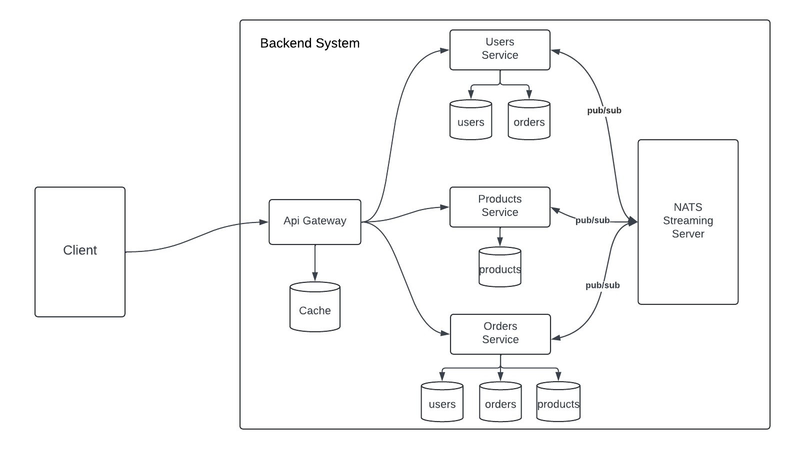

<h1 align="center">Backend Microservices System</h1>

A microservices-based backend system leverages an event-driven architecture, utilizing NATS Streaming Server as a messaging queue, and implements GraphQL as the API gateway, which enables users to order products securely and efficiently.
## <a name="tech-stack">⚙️ Tech Stack</a>

#### Development Stack

[](https://skillicons.dev)

#### Database and Data Storage

[](https://skillicons.dev)

#### Containerization and Orchestration:

[](https://skillicons.dev)


### Services:

- **API Gateway**: It transmits the incoming request and checks authentication and authorization.

- **Users Service**: Manage all user-related tasks.
  1.  Create user functionality
  2. Get User by Id
  3. Get all Users
  4. Sign In
- **Product Service**: Manage all Product-related tasks
  1. Create Product functionality
  2. Get product by Id
  3. Get all Products
- **Order Service**: Manage all Order-related tasks
  1. Create Order functionality
  2. Get order by Id
  3. Get all order


### System Diagram:



## <a name="quick-start">🤸 Quick Start</a>
### Prerequisites


- Docker
- Docker Compose


### Installation

1. Clone the repository:
   
```bash
https://github.com/rizwanmoha/Backend-Assignment.git
```
2. Navigate to the project directory:
   
```bash
cd Backend-Assignment
```
### Running the Application
To build and run the application, execute the following command:

```bash
docker-compose up --build
```
** If the above command does not work or if you encounter any errors, try running the same command again in the terminal.**

### How to Become an Admin
First, create a normal user in application.

### Run the following command to list running containers:

```bash
docker ps
```
Copy the container ID of the container named syncchain-postgres-users-1.

### Access the PostgreSQL container using:

```bash
docker exec -it {copied_Id} sh
```
### Connect to PostgreSQL:

```bash
psql -U postgres
```

### Switch to the users database:

```bash
\c usersdb
```
### Update the user role to admin with the following command:

```bash
UPDATE "User" SET role = 'admin' WHERE email = 'EMAIL_THAT_YOU_WANT_TO_MAKE_ADMIN';
```
**The current user is now set as an admin.**

**Sign in again to obtain the updated JWT token required for creating products as an admin.**

### Protected Routes
- **To Create a Product:** You must be signed in as an admin.
- **To Place an Order:** You must be signed in as a normal user.

## To access protected routes

- Sign in first by providing your email and password. 
- After signing in, you'll receive a token that you need to include in the request headers. 
- Set the Authorization header as follows:
```bash
Authorization: YOUR_TOKEN
```
### Accessing All Routes 
**Use the following URL to access all routes:**

```bash
http://localhost:8000/graphql
```


